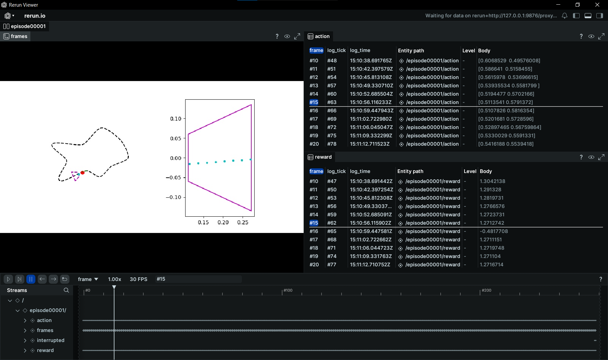

Record Reinforcement Learning gymnasium environments using Rerun.



For this example a wrapper was created to be called during training with stable-baselines3. Training for a large number of steps can result in larger than memory `.rdd` files, so the following options are included in the wrapper:
- `filename` - Saves the logged data to the specified file. **Not compatible with invoking the viewer!**
- `skip_episodes` - Jumps the indicated number of episodes to keep the `.rdd` file smaller.
- `viewer` - It's possible to choose between `script` or `notebook` depending on how the training code is executed.

## Run the code
To run this example you can install it with `uv`:
```shell
pip install uv
git clone https://github.com/ag-mout/rerun_demo
cd rerun_demo
uv sync
```
In the folder you can find two examples:
- `main.py` - Runs 1000 random steps, which are logged to the native viewer (called by rr.spawn()).
- `training_example.ipynb` - Trains a line follower model based on <https://github.com/ag-mout/gym-line-follower>, and saves a test run to a `.rrd` file to be opened in the native viewer after completion.

The notebook can also be executed on Google Colab at: 